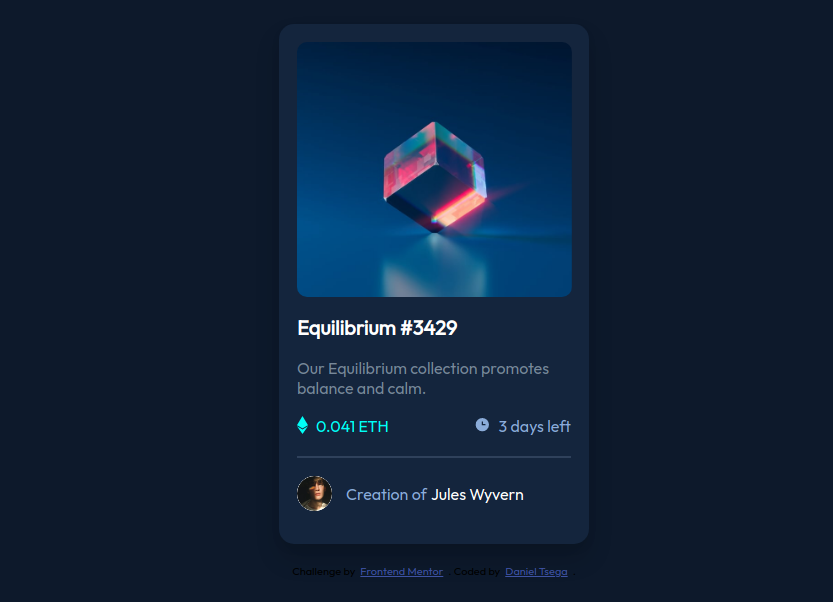

# Frontend Mentor - NFT preview card component solution


This is a solution to the [NFT preview card component challenge on Frontend Mentor](https://www.frontendmentor.io/challenges/nft-preview-card-component-SbdUL_w0U). I have used Simple **HTML** and **CSS** code for this solution.

## Table of contents

- [Overview](#overview)
  - [The challenge](#the-challenge)
  - [Screenshot](#screenshot)
  - [Links](#links)
- [My process](#my-process)
  - [Built with](#built-with)
  - [What I learned](#what-i-learned)
  - [Continued development](#continued-development)
  - [Useful resources](#useful-resources)
- [Author](#author)


## Overview

### The challenge

Users should be able to:

- View the optimal layout depending on their device's screen size
- See hover states for interactive elements

### Screenshot



### Links

- Solution URL: [solution URL here](https://your-solution-url.com)
- Live Site URL: [live site URL here](https://dannysanchez6658.github.io/nft-preview-card-component/)

## My process

### Built with

- Semantic HTML5 markup
- CSS custom properties
- Flexbox
- Mobile-first workflow

### What I learned

In this Challange I encountered so many new things in **CSS** and **HTML**, which I learned all about **Responsive** Design and **MObile-First** Design. Finally I saw a lot of improvments in my **HTML** and **CSS** skill.


```html
<h1>Equilibrium #3429</h1>
```
```css
body {
  background-color: hsl(217, 54%, 11%);
  display: flex;
  flex-direction: column;
  align-items: center;
  justify-content: center;
}
```

### Continued development

I really want to improve this project using **JavaScript**.


### Useful resources

- [W3School](https://www.w3schools.com/howto/tryit.asp?filename=tryhow_css_image_overlay_opacity) - This helped me on how opacity and hovering properties work. I really liked this pattern and will use it going forward.

## Author

- Frontend Mentor - [@DannySanchez6658](https://www.frontendmentor.io/profile/DannySanchez6658)


